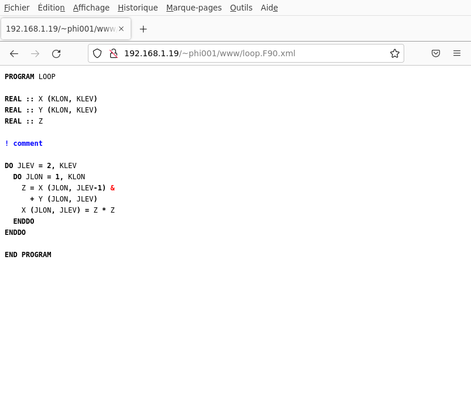
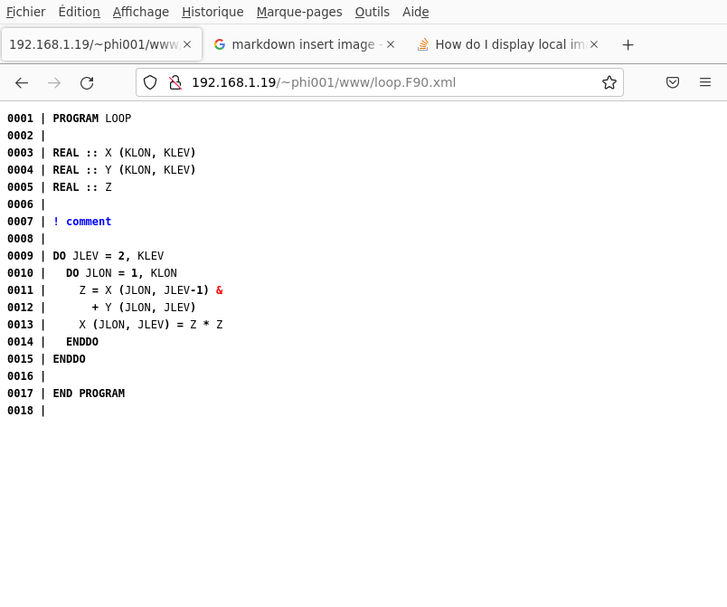
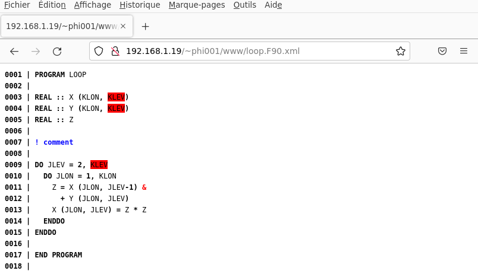

This article has been published on [xml.com](https://www.xml.com/articles/2022/05/31/parsing-and-refactoring-fortran-code-xml/).

# Parsing and refactoring FORTRAN code with XML

## Introduction

FORTRAN (FORmula TRANslation) is a compiled language widely used in scientific computing. It has been
designed in the middle of the twentieth century and underwent substantial evolutions over the last 50 
years (1977, 1990, 2003, 2008).

The specification of FORTRAN is described in the ISO/IEC 1539 document using the Backus-Naur form (BNF) syntax. For
instance, a FORTRAN program is defined as :

    R201 program is program-unit
                       [ program-unit ] ...
    
    R202 program-unit is main-program
                      or external-subprogram
                      or module
                      or submodule
                      or block-data
    
    R1101 main-program is [ program-stmt ]
                             [ specification-part ]
                             [ execution-part ]
                             [ internal-subprogram-part ]
                             end-program-stmt

An expression is defined by :

    R714 and-operand is [ not-op ] level-4-expr

    R715 or-operand is [ or-operand and-op ] and-operand

    R716 equiv-operand is [ equiv-operand or-op ] or-operand

    R722 expr is [ expr defined-binary-op ] level-5-expr

    R718 not-op is.NOT.

    R719 and-op is.AND.

    R720 or-op is.OR.

    R721 equiv-op is .EQV.
            or .NEQV.

Et cetera.

Generating a parser from the BNF definition is however not straightforward, because :

1. There are no reserved keywords; it is legal, for instance to have a variable named `IF` or `SUBROUTINE`.
2. A lot of constraints apply. These are listed in the ISO/IEC 1539 document.
3. In fixed form, spaces are not significant. That is, a routine such as :

        SUBROUTINE MYSUB (X, Y)
        IMPLICIT NONE
        REAL X
        REAL Y
        END SUBROUTINE

could also be defined as :

        SUB ROUTINE MY SUB (X, Y)
        IMPLICITNONE
        REALX
        R E A L Y
        ENDSUBROUTIN E

4. Linebreaks and commends can be inserted almost anywhere :

        CHARACTER(LEN=16) :: STR
        REAL X, Y, ZZ
        STR = "EXAMPLE OF&  
        ! This is a comment
              &STRING"
        X = Y + Z& ! Another comment
           &Z
        END

Implementing a FORTRAN parser is therefore a non trivial task. It has to be emphasized that such a tool
has a very high value for people (like the author) who are involved in the maintenance and the evolution
of codebases consisting of several millions of lines of FORTRAN code.

## Parsing FORTRAN code using fxtran

Several tools are available for parsing FORTRAN: some compilers (OMNI or gfortran) can dump the syntax tree they 
create during syntax analysis. Some other tools, like fparser or OpenFortranParser provide the user with
a syntax tree and do not compile the code. All these tools cannot perform round tripping, that is, the exact
original FORTRAN source code cannot be recovered from the result of the parsing.

This is because features like whitespaces, line breaks, or even comments are ignored by the parser.

FORTRAN code is semi-structured data (a syntax tree can be derived from source code), but it is also data 
created by a human being, with some indentation, whitespaces, comments, etc. We know that XML shines when it
comes to representing such data. HTML is a typical example of documents that may be hand written but that have a
structure. 

fxtran (https://github.com/pmarguinaud/fxtran) is a FORTRAN parser written in C which relies on XML for its output. 
It handles most of FORTRAN 2003/2008 features and is extremely fast, at least 10 times faster that fparser.

FORTRAN source code annotated with XML tags is the result of parsing by fxtran. Let us take a very simple example
of a FORTRAN program:

    PROGRAM MAIN
    REAL :: X, Y, Z
    X = Y + Z
    CALL SUB (X, Y, Z)
    END

The result of parsing this program with fxtran is :

    <?xml version="1.0"?><object xmlns="http://fxtran.net/#syntax" source-form="FREE" source-width="132" openmp="0" openacc="0"><file name="main.F90"><program-unit><program-stmt>PROGRAM <program-N><N><n>MAIN</n></N></program-N></program-stmt>
    <T-decl-stmt><_T-spec_><intrinsic-T-spec><T-N>REAL</T-N></intrinsic-T-spec></_T-spec_> :: <EN-decl-LT><EN-decl><EN-N><N><n>X</n></N></EN-N></EN-decl>, <EN-decl><EN-N><N><n>Y</n></N></EN-N></EN-decl>, <EN-decl><EN-N><N><n>Z</n></N></EN-N></EN-decl></EN-decl-LT></T-decl-stmt>
    <a-stmt><E-1><named-E><N><n>X</n></N></named-E></E-1> <a>=</a> <E-2><op-E><named-E><N><n>Y</n></N></named-E> <op><o>+</o></op> <named-E><N><n>Z</n></N></named-E></op-E></E-2></a-stmt>
    <call-stmt>CALL <procedure-designator><named-E><N><n>SUB</n></N></named-E></procedure-designator> (<arg-spec><arg><named-E><N><n>X</n></N></named-E></arg>, <arg><named-E><N><n>Y</n></N></named-E></arg>, <arg><named-E><N><n>Z</n></N></named-E></arg></arg-spec>)</call-stmt>
    <end-program-stmt>END</end-program-stmt></program-unit>

The careful reader has already noticed that **the original source code is embedded** in this XML document. This 
implies that recovering the original content is just a matter of removing the XML tags. Please also note that whitespaces
and linebreaks matter, which is why we did not reformat the XML (this would have altered its meaning).

Let us have a closer look.

The following FORTRAN statement :

    CALL SUB (X, Y , Z)

is represented by the following XML fragment :

    <call-stmt>CALL <procedure-designator><named-E><N><n>SUB</n></N></named-E></procedure-designator> (<arg-spec><arg><named-E><N><n>X</n></N></named-E></arg>, <arg><named-E><N><n>Y</n></N></named-E></arg>, <arg><named-E><N><n>Z</n></N></named-E></arg></arg-spec>)</call-stmt>

We first observe that we have a `call-stmt` tag surrounding the whole statement. `call-stmt' is the denomination 
used in the ISO/IEC 1539; note that I have tried to **use the FORTRAN BNF linguo eveywhere it is possible** in 
the fxtran output.

Some other important elements are tagged with `named-E`; these are named expressions (`E` stands for expression,
and there are so many expressions in FORTRAN source code, that it was necessary to use a shorter word). There
are other kinds of expressions like literal expressions (`literal-E`), expressions involving operators (`op-E`), etc.

The reader should now be able to distinguish other tags, such as the `procedure-designator` (the name of 
the callee, which is also a named expression), the arguments of the callee, etc.

The following statement :

    REAL :: X, Y, Z

is a type declaration statement, whose parsed output is :

    <T-decl-stmt><_T-spec_><intrinsic-T-spec><T-N>REAL</T-N></intrinsic-T-spec></_T-spec_> :: <EN-decl-LT><EN-decl><EN-N><N><n>X</n></N></EN-N></EN-decl>, <EN-decl><EN-N><N><n>Y</n></N></EN-N></EN-decl>, <EN-decl><EN-N><N><n>Z</n></N></EN-N></EN-decl></EN-decl-LT></T-decl-stmt>

It is possible to distinguish the type specification (the `REAL` intrinsic type is used here), and entity 
declarations (`EN-decl`) tags, grouped in a list (`EN-decl-LT`, `LT` being the abbreviated form of list).

Eventually note that FORTRAN identifiers are tagged with `n`s nested in `N` tags. To understand why, look at the
following assignment statement :

    XX = Z&
      &ZZZ

whose XML representation is :

    <a-stmt><E-1><named-E><N><n>XX</n></N></named-E></E-1> <a>=</a> <E-2><named-E><N><n>Z</n><cnt>&amp;</cnt>
      <cnt>&amp;</cnt><n>ZZZ</n></N></named-E></E-2></a-stmt>

We see here that an identifier may be split across multiple lines, using `&` lines continuators. To cope with
this possibility, it is necessary to introduce this extra `n` tag, which stands for a piece of identifier.

The important thing to remember from this section is that fxtran output is a syntax tree describing the full FORTRAN
source code structure with the finest level of detail, but which also contains the original document and its layout.

## FORTRAN code refactoring

Once the FORTRAN source has been parsed, it becomes possible to perform surgery (eg adding an
extra argument to a particular subroutine). 

In this article, we will look at a typical modification which is necessary when porting the existing code 
(which works well on x86 platforms with micro-vectorization) to accelerators such as graphical processors.

Let us take as an example the following code snippet :

    SUBROUTINE LOOP (KLON, KLEV, X, Y)

    INTEGER :: KLON
    INTEGER :: KLEV
    REAL :: X (KLON, KLEV)
    REAL :: Y (KLON, KLEV)
    REAL :: Z

    INTEGER :: JLON, JLEV

    DO JLEV = 2, KLEV
      DO JLON = 1, KLON
        Z = X (JLON, JLEV-1) + Y (JLON, JLEV)
        X (JLON, JLEV) = Z * Z
      ENDDO
    ENDDO

    END SUBROUTINE

On x86, the inner loop would vectorize, and the compiler would generate AVX instructions, but when using 
graphical accelerators (hereafter GPUs), the situation is very different, because these devices are an
aggregate of thousands of very small cores which do not have any vectorization capability, but nevertheless
require coordinated access to memory. The reader should not pay too much attention to these details, but
needs to understand that our purpose is to tranform this loop (as well as all loops which are similar)
into :

    !$acc loop vector private (Z)
    DO JLON = 1, KLON
      DO JLEV = 2, KLEV
        Z = X (JLON, JLEV-1) + Y (JLON, JLEV)
        X (JLON, JLEV) = Z * Z
      ENDDO
    ENDDO

What we did in this transformation is that we exchanged the loops on `JLON` and `JLEV` and added an OpenACC
directive stating that the iterations of this loop should be distributed over the GPU cores, and that
`Z` is a private variable, which means that each GPU core should have its own private copy of this variable.

Therefore, our transformation involves the following steps :

* Parse the document
* Target the loops that should be transformed (`JLON` loops nested in a `JLEV` loop)
* Exchange `JLEV` and `JLON` loops
* Find private variables (scalar variables which are modified in the `JLON` loop)
* Create the OpenACC directive and insert it before the loop nest

Parsing the document is straightforward; we first invoke fxtran (the `-construct-tag` option adds tags for
structures like loops, if then else constructs, etc.):

    $ fxtran -construct-tag loop.F90
    $ ls -l loop.F90.xml 
    -rw-rw-r-- 1 phi001 phi001 2825 mai   27 09:29 loop.F90.xml

We then use an XML parser and load the XML document, after registering the fxtran namespace (here I
use Perl and the libxml2 bindings, but any other language with any other XML library would do the job) :

    use XML::LibXML;
    use strict;
   
    my $uri = 'http://fxtran.net/#syntax';

    my $xpc = 'XML::LibXML::XPathContext'->new ();
    $xpc->registerNs (f => $uri);
    my $doc = 'XML::LibXML'->load_xml (location => 'loop.F90.xml');
    ...

We can then search `JLEV` loop constructs which contain `JLON` loops using XPath :

    my @do_jlev = $xpc->findnodes 
                  ('//f:do-construct[f:do-stmt[string(f:do-V)="JLEV"]]'
                .  '[f:do-construct[f:do-stmt[string(f:do-V)="JLON"]]]',
                   $doc);
    ...

The DO statements we need to exchange are easily retrieved :

    for my $do_jlev (@do_jlev)
      {
        my ($do_jlon) = $xpc->findnodes ('./f:do-construct[f:do-stmt[string(f:do-V)="JLON"]]', $do_jlev);
        my $do_jlev_stmt = $do_jlev->firstChild;
        my $do_jlon_stmt = $do_jlon->firstChild;
        ...

And it is also easy to exchange them using the XML DOM methods :

        my $do_jlev_stmt_1 = $do_jlev_stmt->cloneNode (1);
        my $do_jlon_stmt_1 = $do_jlon_stmt->cloneNode (1);
        $do_jlev_stmt->replaceNode ($do_jlon_stmt_1);
        $do_jlon_stmt->replaceNode ($do_jlev_stmt_1);
        ...
     
We then look for scalars (that is named variables without a reference list) which are on the left hand side 
of assignment statements (that is contained in the `E-1` member of `a-stmt` elements):

        my @s = $xpc->findnodes ('.//f:a-stmt/f:E-1/f:named-E[not(f:R-LT)]/f:N/f:n/text()', $do_jlev);
        @s = map { $_->textContent } @s;
        ...

We can then generate the OpenACC directive and insert it in the XML document, before the `JLEV` loop:

        my $acc = "!\$acc loop vector" . (@s ? " private (" . join (', ', @s) . ")" : '');
        
        my $C = 'XML::LibXML::Element'->new ('C');
        $C->setNamespace ($uri, 'f');
        $C->appendChild ('XML::LibXML::Text'->new ($acc));

        $do_jlev->parentNode->insertBefore ($C, $do_jlev);
        $do_jlev->parentNode->insertBefore ('XML::LibXML::Text'->new ("\n"), $do_jlev);

      }

The final FORTRAN source code is retrieved just by removing XML tags :

    print $doc->textContent;

And that is :

    SUBROUTINE LOOP (KLON, KLEV, X, Y)

    INTEGER :: KLON
    INTEGER :: KLEV
    REAL :: X (KLON, KLEV)
    REAL :: Y (KLON, KLEV)
    REAL :: Z

    !$acc loop vector private (Z)
    DO JLON = 1, KLON
      DO JLEV = 2, KLEV
        Z = X (JLON, JLEV-1) + Y (JLON, JLEV)
        X (JLON, JLEV) = Z * Z
      ENDDO
    ENDDO

    END SUBROUTINE

Et voilà !

This example is of course a simplified version of what we have to deal with in real life, but it 
clearly proves that it is possible :

* to parse FORTRAN source code using XML
* to search FORTRAN source using XPath
* to apply transforms to FORTRAN source code using the XML DOM methods

## Loading FORTRAN source code in firefox 

XML is the language for representing semi-structured data, but it is also the language of choice
for displaying content on the web. A side effect (the primary goal was automated transformation
of source code) of parsing FORTRAN source code into XML is that it is now possible to attach an 
XSL stylesheet to an XML document produced by fxtran, and load the document in firefox.

Attaching the XSL stylesheet is straightforward :

     <?xml version="1.0"?><?xml-stylesheet type="text/xsl" href="fxtran.xsl"?>

We list here the contents of the stylesheet :

    <?xml version="1.0"?>
    <xsl:stylesheet version="1.0" 
     xmlns:xsl="http://www.w3.org/1999/XSL/Transform" 
     xmlns:f="http://fxtran.net/#syntax"
     xmlns:html="http://www.w3.org/1999/xhtml">
    
      <xsl:output method="xml"/>
    
      <xsl:template match="*">
        <xsl:copy-of select="."/>
      </xsl:template>
    
      <xsl:template match="/f:object">
    
    
    <html:link rel="stylesheet" href="fxtran.css"/>
    
    <html:script src="fxtran.js"/>
    
    <html:body onload="_onload()">
    
        <xsl:apply-templates/>
    
    </html:body>
    
      </xsl:template>
    
    </xsl:stylesheet>

Its purpose is merely to embed the XML document inside an HTML page, attach a CSS stylesheet to it
and trigger the `onload` function once the document is loaded.

With an empty `onload` function, we get some nice FORTRAN code, with some colors brought in by 
the CSS (note that for some reason, the document has to be served by an actual HTTP server, just
loading from your local disk will not enable the XSL processing) :

Cool ! 

But we can do much better : we can modify the document from within the `onload` function so that the lines
get numbered; to achieve this, we create the javascript `numberLines` function :

    function numberLines ()
    {
      let ns = findNodes ('//f:file');
      
      let f = ns.snapshotItem (0);
      
      f.insertBefore (document.createTextNode ("\n"), f.firstChild);
        
      ns = findNodes ('//f:file//text()[contains(.,"\n")]');
                    
      let I = 1;                            
      for (let i = 0; i < ns.snapshotLength; i++)
        {
          let s = ns.snapshotItem (i);
          let t = s.textContent;
          let tt = t.split (/\n/);
          let nsi = s.nextSibling;
    
          let ll = tt.pop ();
    
          for (t of tt)
            {
              let L = document.createElementNS (fxtranURI, "L");
              L.appendChild (document.createTextNode (("0000" + I).slice (-4) + " | "));
              let tn = document.createTextNode (t + "\n");
              s.parentNode.insertBefore (tn, nsi);
              s.parentNode.insertBefore (L, nsi);
              I++;
            }
    
          ll = document.createTextNode (ll);
          s.parentNode.insertBefore (ll, nsi);
          s.parentNode.removeChild (s);
        }
        
      f.removeChild (f.firstChild);
      f.removeChild (f.lastChild);
    }

I will not detail the `numberLines` function, but it works, and you can see its result on the document 
in the following snapshot :

Another thing we can do is adding event listeners, and highlight some variables when the user
selects one of them using the mouse :

Et cetera. 

## Conclusion

In this article, we have seen how XML can be used to parse FORTRAN. The principles described here
could surely be applied to some other languages such as C++ or Java. Producing XML as the result of
parsing source code offers several benefits :

* the original document can be retrieved, or if some modifications have been applied, then the impact
on the source code is kept to the minimal
* XML power tools (XPath, XML DOM, etc.) can be used to modify the document
* the cherry on the cake is that an XSL stylesheet can be attached to the XML document, allowing for
loading the source code in a web browser

